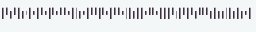

# IMbSynth

Intelligent Mail Barcode synthetic data generator

## Installation
To run this module you need to install [font](https://postalpro.usps.com/IMbFontDownload-presentation) that is used by USPS

## How to run?
Use command line interface to 

## How does it work?

Run command line interface to generate synthetic data.
```
python -m generator.__init__ --size=10000
```
You can also specify output folder where images and specific .csv will be generated.

# Data samples
 FAAFTATAFFADDTTFDTDTTATDDFFAFDADAFFDDTDFFFDAFTTDTAAFFTFDFFTFAFFFA
 FADDFDFTDTDADATADTAAAAFATFFATTADAAADFFFAATTDAADFTTATTDTFDFFAAADTA
 DADTTTTTADDTDTTFATFTDAFFTFFTFAATFFFFTDAFADTDTTFFADFAFADATATTTAAFF,
 DDFFTTADAAFDADDDTTAFADAFTDAADFFTAFTDTDFATDTAAFFFTFAAFTFAFFADFTTDF
 FADAFDTFTFATFATAATFFDTFAAFATFAATFFDFFTAATFFFADFAFADAAADFDDFFDFDTF
 AFTTTFDDTTDDFFFFAFTTDDTDFATADTTTAATAFTAFDATFTAATATFAAAFTDATDATTFT
 DADFADDTFFTAAFDTTDFAFAAAAFDDTAAFDDDAAAAFAFDTDADTDTDAATADFTDADATTD
 DDTDADFTADDDDTDDTTADDTAAADTDDAFADDDTFFDDDDADDADDTTTDAFAFDDFAFTDDA
 AFFTTAFFAFADTDDTAAFDAATAADFATTFDAAAATAAATAAADAADTTDAADFDTTAFDFDFF
 FFTTFFTAFDDAAFFTAFTAAFADFFTDFDTTFTADDADFTAFDDAFTAADADDATADADAATTT